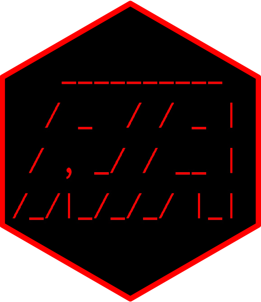

<!-- README.md is generated from README.Rmd. Please edit that file -->

# Radiomics Image Analysis (RIA) 

<!-- badges: start -->

[](https://CRAN.R-project.org/package=RIA)
[](https://CRAN.R-project.org/package=RIA)
[](https://CRAN.R-project.org/package=RIA)
[](https://CRAN.R-project.org/package=RIA)
[](https://lifecycle.r-lib.org/articles/stages.html#stable)
[](https://CRAN.R-project.org/package=RIA)
<!-- badges: end -->

Radiomics Image Analysis (RIA) package was developed to facilitate
radiomic analysis of medical images. `RIA` can calculate hundreds of
different statistics on both 2D and 3D images. `RIA` supports analysis
of `DICOM`, `NIfTI`, `nrrd` and `npy` (numpy arrays saved in python)
images. Almost all calculations are vectorized and therefore are
super-efficient. The package is developed by Márton Kolossváry a medical
doctor not an engineer, therefore all functionalities of the software
package are developed in a way that can be learnt by non-professionals.
`RIA` is constantly updated with new functionalities and wrap-around
functions to make the calculation of radiomic metrics even simpler.

## Installation

You can install the released version of RIA from
[CRAN](https://CRAN.R-project.org) with:

``` r
install.packages("RIA")
```

# Its as easy as 1, 2, 3

RIA allows users to take control of each and every aspect of radiomic
analysis using specific functions. However, for most users 3 lines of
simple code: one loading the data and one calculating the statistics,
and one exporting the results is enough:

``` r
#Load the data by providing the location of the DICOM, NIfTI npy or nrrd file(s)
DICOM <- load_dicom(filename = "C:/Image/")

#Calculate first-order, GLCM, GLRLM and geometry based statistics
DICOM <- radiomics_all(DICOM, equal_prob = "both")

#Save output to csv
save_RIA(DICOM, save_to = "C:/Test/", save_name = "My_first_radiomics", group_name = "Case")
```

These three simple lines of code result in thousands of radiomic
parameters calculated for the given image! If you wish to better
understand Radiomics I would suggest reading [“Cardiac Computed
Tomography Radiomics: A Comprehensive Review on Radiomic
Techniques”](https://pubmed.ncbi.nlm.nih.gov/28346329/) and [“Radiomic
Features Are Superior to Conventional Quantitative Computed Tomographic
Metrics to Identify Coronary Plaques With Napkin-Ring
Sign”](https://pubmed.ncbi.nlm.nih.gov/29233836/) which describes the
calculation and each statistic in detail in the supplementary files.

# Detailed description of functions

First, lest simply load `RIA`

``` r
library(RIA)
```

## Converting medical images to RIA_image

Medical images can be converted to RIA_image class using the
*load_dicom*, *load_nifti*, *load_nrrd* and the *load_npy* functions.
All you have to do is give the location of the file or files as a
string. Current examples are given for *load_dicom*, however
*load_nifti*, *load_nrrd* and *load_npy* work the same, but please be
aware of subtle differences explained in help of these functions and in
specific sections of the user manual!

``` r
DICOM = load_dicom(filename = "C:/DICOM/")
```

*load_dicom* does several things:

-   Converts DICOM files to RIA_image class using the *readDICOM*
    function of the *oro.dicom* package. If *load_nifti* is used the
    image loading is done by the *readNIfTI* function of the *oro.nifti*
    package, while the function *read.nrrd* is used from the *nat*
    package in case *load_nrrd* is used. For images saved in numpy
    arrays, one can use the *load_npy* function. Be aware that,
    reticulate needs to be installed with a working
    [python](https://www.python.org) and [numpy](https://numpy.org)
    distribution. Also, as the numpy array contains no meta-information,
    pixel spacing and spacing between the slices arguments need to be
    supplied during the loading of the image.

-   If **mask_filename** is provided, then the image is filtered one of
    two ways. If the **mask_filename** is the same as the **filename**,
    then the values in **keep_mask_values** indicate which voxels values
    to keep in the original image. This way the image can be segmented
    for a specific subset of voxels with given intensities. For example,
    if you would wish to only analyze low-density non-calcified voxels,
    you could set the **keep_mask_values** to **-100:30**. If a
    different folder is given to **mask_filename**, then *RIA* loads the
    mask image which needs to be the same image type as the original
    image. **mask_filename** can also be a character vector containing
    paths to multiple mask files. If multiple are supplied, then those
    voxels are kept which have one of the values of **keep_mask_values**
    in any of the supplied masks. Using the **keep_mask_values**, you
    can select which values you consider to indicate which voxels to
    keep. By convention, the default is 1. However, multiple values may
    be given, which is convenient in cases when several regions of
    interest are provided in the mask image. If a single string is
    provided, then each element of the mask will be examined against the
    statement in the string. For example, if **‘\>0.5’** is provided
    i.e. the mask is probabilities after a DL algorithm, then all voxels
    with values >0.5 in the mask image will be kept. This can be a
    complex logical expression. The data on which the expression is
    executed is called data or data_mask, depending on whether you wish
    to filter the original image, that is the original image is supplied
    as a mask, or if you have unique mask files respectively. Therefore,
    for complex logical expressions you can define for example:
    **‘\>-100 & data\<30’** to consider data values between -100 and 30,
    or **‘\>0.5 & data_mask\<0.75’** to select voxels based-on mask
    values between 0.5 and 0.75 for example if they represent a
    probability mask. Furthermore, some software after image
    manipulation reverse the order of the images in the Z axis, and
    therefore they need to be changed back. In this case **switch_z**
    needs to be set *TRUE*. Whenever using mask images to identify
    voxels to be analyzed, please always make sure, that the orientation
    of the mask image and of the original image is the same!

-   The 2D or 3D image is cropped to the smallest bounding box still
    containing the whole image. It is useful to minimize the size of the
    image to save memory. The **zero_value** supplied to the
    *load_dicom*, *load_nifti*, *load_nrrd* or *load_npy* function is
    used to identify voxels not containing any data. If it is not
    supplied, then the smallest value present in the dataset is
    considered as indicating voxels without any data. If for some reason
    it is important that the RIA_image be the same size (same x,y,z
    dimensions) as the original supplied image, then this functionality
    can be turn off by:

``` r
DICOM = load_dicom(filename = "C:/DICOM/", crop_in = FALSE)
```

-   Then the smallest values which indicate no data, are changed to *NA*
    for further calculations. If wished to be turned of, then use:

``` r
DICOM = load_dicom(filename = "C:/DICOM/", replace_in = FALSE)
```

-   Since some DICOM images do not store negative values, rather store
    all values as non-negative integers, shifting of the values is
    needed. The desired smallest value is set by the **min_to** input.
    If not specified then by default it is set to *-1024*. Please check
    for all data whether shifting is needed! If shifting of the values
    is not needed then use:

``` r
DICOM = load_dicom(filename = "C:/DICOM/", center_in = FALSE)
```

By default **center_in** is set to *FALSE* for *load_nifti*,*load_nrrd*
and *load_npy*, since these images are often preprocessed and therefore
contain the proper values for analysis. But please be aware, that in all
cases, the load images should be inspected to see in the values are
reasonable, for example if the minimum and maximum values are in the
range that would be expected!

-   Finally, *load_dicom*, *load_nifti*, *load_nrrd* and *load_npy* adds
    basic information regarding the original image and ran processes
    into the *header* (if available) and *log* slot of *RIA_image*.

All above mentioned settings can be combined as wished to achieve proper
conversion of the DICOM image. Furthermore, all parameters of the
*readDICOM*, *readNIfTI*, *read.nrrd* *np.load* function of the
*oro.dicom* *oro.nifti*, *nat* and *numpy (python)* packages can be set
in the *load_dicom*, *load_nifti*, *load_nrrd* and *load_npy* functions.

As a result the *RIA_image* object will have three slots:

-   **`RIA_image$data`** which contains the original image as a 2D or 3D
    numerical array in `RIA_image$data$orig`, and a modified image in
    `RIA_image$data$modif` that has been created using one of the
    functions. Only one original and one modified image are stored in
    the `RIA_image$data` slot. However, several modified images can be
    saved to new slots as we will see later.

-   **`RIA_image$header`** which contains basic information regarding
    the loaded image. These entries are populated from the DICOM header
    of the image. Elements can be added or removed from the predefined
    set of DICOM_codes:

``` r
DICOM_codes
```

Elements can be added by specifying the desired DICOM codes. For example
the Manufacturer can be add by:

``` r
add <- as.data.frame(array(c("Manufacturer", "0008", "0070"), dim = c(1,3)))
colnames(add) <- c("Name", "Group", "Element")
DICOM = load_dicom(filename = "C:/DICOM/", header_add = add)
```

Or elements can be removed. For example if you wish to anonymize your
data:

``` r
exclude <- as.data.frame(DICOM_codes[3:6,])
DICOM = load_dicom(filename = "C:/DICOM/", header_exclude = exclude)
```

-   **`RIA_image$log`** which contains information regarding the
    original image and ran processes on the *RIA_image*. The log is
    constantly updated by the functions, and some functions use it for
    inputs. *load_dicom*, *load_nifti*, *load_nrrd* and *load_npy* adds
    the following to the log if possible:

    -   `DICOM$log$events` is a vector containing the ran processes.

    -   `DICOM$log$orig_dim` is a vector containing the original
        dimensions of the DICOM image.

    -   `DICOM$log$directory` is a string containing the location of the
        DICOM images.

    -   `DICOM$log$logic_x` is a vector with a length of the original x
        dimension. Ones indicate slices which contained data and zeros
        which did not in the x dimension. Same is true for
        `DICOM$log$logic_y` and `DICOM$log$logic_z`.

    -   `DICOM$log$zero_value` is a number indicating the value that was
        considered to indicate no data

    -   `DICOM$log$changed_to` is the value to which voxel considered
        not to have any data were transferred to.

    -   `DICOM$log$shift` the value that was added to all voxel values
        to achieve proper values.

    -   `DICOM$log$orig_vol_mm` the volume of the original image. The
        volume is calculated by calculating how many voxels contain data
        and multiplying it by x,y and z length of the voxels.

    -   `DICOM$log$orig_surf_mm` the surface of the original image. The
        surface is calculated by assessing which sides of the voxels do
        not have any neighbors and then summing all of these surfaces
        which are calculated from the lengths of the sides of the
        voxels.

    -   `DICOM$log$surface_volume_r` the value of the surface to volume
        ratio of the original image.

    -   `DICOM$log$orig_xy_dim` the length of each voxel in the x and
        the y planes. This is also called the in-plane resolution

    -   `DICOM$log$orig_z_dim` the length of each voxel in the z plane.
        This is also called the cross-plane resolution.

As we will see, functions can add new elements to the log and also add
new slots to the *RIA_image*. If the loading was successful, we will be
notified by `RIA` in the console. All messages may be suppressed by
setting the **verbose_in** parameter to *FALSE*.

With the package two preloaded datasets are given:

-   **NRS**: the DICOM images of a segmented plaque showing the
    napkin-ring sign
-   **Non_NRS**: the DICOM images of a segmented plaque without the
    napkin-ring sign

We will be using the NRS dataset for all following examples. Load the
data using:

``` r
DICOM <- NRS
```

## Merging different segmentations of the same image

In cases where instead of a segmentation masks that can be merged using
the load functions, one might have separate files of the same image
containing only the data from different segmentations. In this case, one
needs to merge these images into one *RIA_image* for further analysis.
This can be done using the *merge_RIA_images* function. It merges
multiple *RIA_image* class objects loaded using any of the load
functions. All images need to have the same dimensions. Further, during
loading the images should not be cropped to assure that the orientation
and position of the data is maintained. Data of the new combined image
is updated sequentially, using data from the
*data$orig* slot, that is only parts of the image that do not have data (which are converted to NA during the load process) are updated in the order of provided *RIA_image*. If multiple images contain data in for the same element, the first value is used in the new image. Data in the *data$log*
slot is updated based on the new combined image, while data in the
*data\$header* slot is copied from the first provided image.

``` r
# Load multiple images and combine them
d1 <- load_nifti(ABC_p1.nii.gz, crop_in = FALSE)
d2 <- load_nifti(ABC_p2.nii.gz, crop_in = FALSE)
d  <- merge_RIA(list(d1, d2))
```

## One click solution to calculate all radiomic parameters

With a simple line of code using the *radiomics_all* function you can
calculate all the desired parameters without any hassle. After loading
the radiological images to `RIA` format, just type the following:

``` r
DICOM <- radiomics_all(DICOM, bins_in = c(8, 16, 32), equal_prob = "both")
```

This simple line of code discretizes the image into 8, 16 and 32 equally
sized and equal interval bins and calculates first-order parameters,
GLCM based statistics averaged in all directions at distances 1, GLRLM
based statistics averaged in all directions and geometry based
statistics on the original and discretized images. Arguments of
*radiomics_all* allows to modify defaults and calculate parameters as
desired.

In the next section learn how to export all you calculated statistics
just using one line of code.

## Export of radiomic statistics

All saved radiomic metrics in the `RIA_image` can be conveniently saved
using the *save_RIA* function. All you have to do is supply the folder
where you wish to export the results to using the **save_to** parameter
You may also set the name of the exported files using the **save_name**
parameter. A grouping label specifying which class the case belongs to
can also be set using the **group_name** parameter. A last but not
least, you may set which slots of statistics you wish to export. By
default all of them are exported:

``` r
save_RIA(DICOM, save_to = "C:/Test/", save_name = "My_first_radiomics", group_name = "Case")
```

And that’s it! There you have your first radiomics analysis!

## Parallelization

Parallelization of the functions on CPUs or GPUs can take significantly
longer in case of small images and few different voxel values. Finding
the optimal values where parallelization might be beneficial is not
straight forward. Also, *RIA* is a research tool, therefore it is meant
to be used for the radiomic calculations of many exported radiological
images at once, rather then running on a single image real-time as fast
as possible. Therefore, the core functions of *RIA* are not
parallelized. However, using a few lines of code *RIA* can be run
parallel on multiple cores, where each core calculates the parameter of
an individual image. This is more efficient and faster when we have
batches of images to calculate on, as all cores can run on maximum at
all times, while if the core functions themselves would be parallelized,
it would not run at maximum efficiency many times while the processes
are waiting for each sub-tasks to finish. In the following sample code,
you can appreciate the simpleness of setting up such a parallelization
to calculate radiomic parameters for a batch of images. In the example
each patient has a separate folder in which there are nrrd files
containing the whole image (these files contain the word: “heart”) and
mask images (these files contain the word: “plaque”). There are many
possibilities to parallelize such batches in R. We will use the
*doParallel* package to set up the multiple core functionality, and the
*foreach* package to parallelize the for cycle which cycles through the
patient folders

``` r
folder <- "/Images/" #Location of folder containing individual folders per patient which contain nrrd files for the image and mask
out <- "/CSV/" #Location of folder where the results will be dumped

patients <- list.dirs(folder, recursive = FALSE, full.names = FALSE) #Name of patient folders
patients_full <- list.dirs(folder, recursive = FALSE, full.names = TRUE) #Name of patient folders with full file path name

library(foreach); library(doParallel); library(RIA) #Load required packages
doParallel::registerDoParallel(7) #Define how many threads to use, usually use the number of threads-1

#Use parallelized for cycle to cycle through all the patients
data_out_paral <- foreach (i = 1:length(patients), .combine="rbind", .inorder=FALSE,
                           .packages=c('RIA'), .errorhandling = c("pass"), .verbose=FALSE) %dopar% {
                             
                             files <- list.files(patients_full[i]) #Names of the files in the current patient folder
                             image <- grep("heart", files, ignore.case = T, value = T) #Full name of the image file
                             masks <- grep("plaque", files, ignore.case = T, value = T) #Full name of the mask files
                             
                             #RUN RIA
                             IMAGE <- load_nrrd(filename = paste0(patients_full[i], "/", image),
                                                     mask_filename = paste0(patients_full[i], "/", masks), switch_z = FALSE) #Load image and mask files
                             IMAGE <- radiomics_all(IMAGE,  equal_prob = "both", bins_in= c(4, 8, 16)) #Calculate radiomic features
                             save_RIA(IMAGE, save_to = out, save_name = patients[i], group_name = patients[i]) #Export results into csv
                           }
```

The disadvantage of parallelizing the for cycle rather then the core
functions is that it requires the loading of each image into memory.
Therefore, please be sure that there is sufficient amount of memory to
load in the number of dataset as specified by the number of threads used
for calculation.

# Hidden functionalities of RIA

From v1.7.0 only wrapper functions are exported in the Namespace of
*RIA* as these allow full functionality without needing to know anything
about what is happening under the hood. Nevertheless, previous functions
that were available in *RIA* are still presnet with all thier
functionalities and documentation, but they can only be accessed by
specificlaly calling them using **RIA:::function()**. From here on,
these functionalities are presented.

## Discretization of voxel values

Discretization of voxel values is crucial for radiomic analysis. Since
many metrics rely on the spatial relationship of different voxel values,
we need to decrease the number of possible values. This is needed since
we do not want to consider for example a voxel value of 456 any
different from 457, since the difference is probably attributable to
noise and does not hold any information regarding spatial heterogeneity.
Discretization is done using the *discretize* function. It receives a
*RIA_image* and outputs a RIA_image with a new slot
`RIA_image$discretized` containing the images with discretized values.

Discretization is effected by two variables:

-   The number of bins to which the values will be transformed to
-   The length of each bin

### Specifing the number of bins

The number of bins can be easily specified using the **bins_in**
parameter.

``` r
DICOM = RIA:::discretize(RIA_data_in = DICOM, bins_in = 2)
```

### Specifying the length of each bin

There are two main types of discretizations. We either have equally
sized or equally probable bins. Equally sized bins mean that the range
between the minimum and the maximum value is divided into a predefined
number of bins of which all have the same lengths. For example is our
smallest value is 0 and the largest is 100 and we wish to discretize
into 4 equally sized bins then the cut points will be at 25, 50 and 75,
result in 4 bins each with a length of 25 units. However if the
discretization is done using equally probable bins then the length of
each bin might be different, but the number of elements in it are the
same. This might result is cut points such as: 10, 35 and 55 for example
in case of a rightly skewed dataset. The type of discretization is
defined by the **equal_prob** parameter. The default is *FALSE*,
therefore by default images are discretized using equal sized bins.
Setting it to *TRUE* will result in equally probable bins:

``` r
DICOM = RIA:::discretize(RIA_data_in = DICOM, bins_in = 2, equal_prob = TRUE)
```

The discretize function updates the log of the *RIA_image* by adding the
discretization to the events:

``` r
DICOM$log$events
```

It also adds the cut points that were used for the discretization:

``` r
DICOM$log$cuts_es_2
DICOM$log$cuts_ep_2
```

The names of the created images and corresponding elements in the *log*
can be changed as we will see later. But for convenience **RIA**
automatically names the new images. If not crucial for some reason, I
would suggest to stick with the automatically predefined names.

### Additional input parameters of discretize function

\-*use_orig:* whether to use the original image (which might be cropped
etc.) stored in `RIA_image$data$orig` or to use the modified image
stored in `RIA_image$data$modif`. By default it is set to *TRUE*. Only
in very special cases might one want to discretize an image that has
already been discretized or modified by an other function.

\-*write_orig:* whether to overwrite the original image stored in
`RIA_image$data$orig`. Usually it is not advised to overwrite the master
image since then only modified images can be further processed.
Therefore, by default it is set to *FALSE*

\-*verbose_in:* whether write information regarding the running
processes in the console.

### Batch discretization

Since the number of bins and the type of discretization can
significantly effect our later results, usually several discretizations
are performed on a image to receive many different images. Using **RIA**
it is very easy to perform several different discretizations with just
one line of code. For example if you wish to discretize your image to 4,
8, 16 and 32 equally sized bins, all you have to do is:

``` r
DICOM = RIA:::discretize(RIA_data_in = DICOM, bins_in = c(4,8,16,32))
```

or more easily if you want 4, 8, 16 and 32 equally probable bins:

``` r
DICOM = RIA:::discretize(RIA_data_in = DICOM, bins_in = 2^(2:5), equal_prob = TRUE)
```

These resulted in our image discretized in 2,4,8,16,32 equally probable
and equally sized bins, which are stored in the `$discretized` slot of
the *RIA_image*:

``` r
DICOM$log$events
names(DICOM$discretized)
```

## First-order statistics

First-order statistics are derived from the distribution of values and
therefore discard all spatial information. Many of these metrics are
commonly known (mean, median), however several metrics describing the
heterogeneity of the values might be less known (energy, entropy). `RIA`
can calculate 44 different first-order statistics using the
*first_order* function. As with all statistical measures, it is saved in
a separate slot of the *RIA_image*, and the name of the slot starts with
*stat\_* and since first-order, end with *fo*, resulting in the slot
name of *stat_fo*. A detailed list and explanation of each statistic can
be found in the supplementary material of: [Márton Kolossváry et
al.](https://pubmed.ncbi.nlm.nih.gov/29233836/)

By default, *first_order* calculates statistics on the image present in
`RIA_image$data$orig`.

``` r
DICOM = RIA:::first_order(RIA_data_in = DICOM)
RIA:::list_to_df(DICOM$stat_fo$orig)
```

If you wish to calculate statistics on a modified image, then by setting
the **use_orig** to *FALSE*, the image present in the
`RIA_image$data$modif` will be used. This is usually the last image that
was created using some kind of image manipulation.

``` r
DICOM = RIA:::first_order(RIA_data_in = DICOM, use_orig = FALSE)
RIA:::list_to_df(DICOM$stat_fo$ep_32)
```

If the desired image is not present in the modif slot, since it was
created earlier, then instead of switching the `RIA_image$data$modif`
image to the desired one, you may give a specific image you wish to use
using the **use_slot** parameter. If the image you wish to use is in
`RIA_image$discretized$es_2`, then you can calculate first-order
statistics on it by:

``` r
DICOM = RIA:::first_order(RIA_data_in = DICOM, use_orig = FALSE, use_slot = "discretized$es_2")
RIA:::list_to_df(DICOM$stat_fo$es_2)
```

### Additional input parameters of first_order function

Calculation of first-order statistics can be further specified using the
following inputs.

-   *save_name* can be used to modify the name of the output. If
    provided, then the automatic name generated is overwritten by the
    provided string.

``` r
DICOM = RIA:::first_order(RIA_data_in = DICOM, use_orig = FALSE, use_slot = "discretized$es_2", save_name = c("equaly_sized_2bins"))
RIA:::list_to_df(DICOM$stat_fo$equaly_sized_2bins)
```

### Batch calculation of first-order statistics

**RIA** supports batch calculation of first-order statistics. In many
cases one wants to calculate the statistics on all modified images.
Using one line of code you can calculate first-order statistics for all
discretized images:

``` r
DICOM = RIA:::first_order(RIA_data_in = DICOM, use_type = "discretized")
names(DICOM$stat_fo)
```

The **use_type** input can be used to specify how the function behaves.
By default, it is set to *“single”*, indicating single image processing.
As seen above, there are multiple ways first-order statistics can be
calculated on single images. However, if **use_type** is set to
*“discretized”*, then the function will calculate the statistical
metrics for all instances present in the given slot.

The **save_name** parameter can still be used to rename the name of the
statistics is needed.

``` r
DICOM = RIA:::first_order(RIA_data_in = DICOM, use_type = "discretized",
                    save_name = c("Name_1", "Name_2", "Name_3", "Name_4",
                                  "Name_5", "Name_6", "Name_7", "Name_8",
                                  "Name_9", "Name_10"))
names(DICOM$stat_fo)
```

Please provide the same number of names as the number of
discretizations. If there is a discrepancy between the number of
provided names and images, then the process will be stopped giving an
error. Only change the names if absolutely necessary, as it may cause
problems in later analyses.

``` r
DICOM = RIA:::first_order(RIA_data_in = DICOM, use_type = "discretized",
                    save_name = c("Name_1", "Name_2", "Name_3", "Name_4"))
```

## Gray level co-occurrence matrix (GLCM) calculations and statistics

The function *glcm* calculates GLCM matrices of 2D and 3D images. GLCMs
are second-order statistics, meaning that statistics are calculated from
the spatial relationship of two voxel values and not from the values
themselves. GLCM are square matrices, where there are as many rows and
columns as there are different voxel values. The values in the
i<sup>th</sup> row and j<sup>th</sup> column represents the probability
of finding a *j* value voxel next to a *i* value voxel in a given
direction and distance. Therefore, for a given image several different
GLCM matrices may be calculated, depending on the *direction* and the
*distance*. In `RIA` *direction* and *distance* is determined by three
integer parameters specifying where the examined voxel is compared to
the index voxel.

-   **off_right**: how many voxels to look to the right (x coordinate)
-   **off_down**: how many voxels to look downwards (y coordinate)
-   **off_z**: how many voxels to look to in the cross-plane direction
    (z coordinate). This parameter is only used if the image is 3D

For example: to calculate the GLCM matrix of the last modified image
stored in `RIA_image$data$modif`, in the direction of right: 1; down: 2;
z-plane: 2; you just have to write:

``` r
DICOM = RIA:::glcm(RIA_data_in = DICOM, off_right = 1, off_down = 2, off_z = 2)
dim(DICOM$glcm$ep_32)
```

As discussed in the first-order case, the image wished to be analyzed
may be set using the **use_orig**, **use_slot** and **save_name**
parameters. `RIA` looks at the name of the provided image, if numbers
are present in it, the it will set the dimensions and the resulting name
of the GLCM based-on these values. If no numbers are present, then it
will use the automatic name generator of `RIA` to figure out the name of
the last image manipulation.

### Additional input parameters of glcm function

Two further parameters may be set to change the output of the function:

-   **symmetric**: If TRUE, then the transpose of the initial GLCM
    matrix will be added to itself, which is the same as calculating the
    GLCM in the opposite direction. Doing so creates a symmetric GLCM
    matrix, which holds information regarding not only one direction,
    but also of the opposite direction as well, since asking how many
    times a *j* value voxel occurs next to a *i* value voxel in a given
    direction is the same as asking how many times a *i* value voxel
    occurs next to a *j* value one in the opposite direction. With this
    strategy, if you wish to calculate the GLCMs in all directions of
    space, then you only have to actually calculate half of them.

``` r
DICOM = RIA:::glcm(RIA_data_in = DICOM, use_slot = "discretized$ep_2", off_right = 1, off_down = 2, off_z = 2, symmetric = FALSE, normalize = FALSE)
DICOM$glcm$ep_2
DICOM = RIA:::glcm(RIA_data_in = DICOM, use_slot = "discretized$ep_2", off_right = 1, off_down = 2, off_z = 2, symmetric = TRUE, normalize = FALSE)
DICOM$glcm$ep_2
```

-   **normalize**: If TRUE, then instead of the absolute values of the
    occurrences are reported, but their relative frequencies.

``` r
DICOM = RIA:::glcm(RIA_data_in = DICOM, use_slot = "discretized$ep_2", off_right = 1, off_down = 2, off_z = 2, symmetric = TRUE, normalize = FALSE)
DICOM$glcm$ep_2
DICOM = RIA:::glcm(RIA_data_in = DICOM, use_slot = "discretized$ep_2", off_right = 1, off_down = 2, off_z = 2, symmetric = TRUE, normalize = TRUE)
DICOM$glcm$ep_2
```

As GLCM statistics require probability values and in most cases GLCMs
are calculated in all directions, both parameters are TRUE by default.

### Batch calculation of GLCM

The *glcm* function also support batch calculations. Therefore, if you
wish to calculate a given GLCM for all discretizations all you have to
do is:

``` r
DICOM = RIA:::glcm(RIA_data_in = DICOM, use_type = "discretized",
             off_right = 1, off_down = 2, off_z = 2)
names(DICOM$glcm)
```

### Batch calculation of GLCM matrices in all directions

To achieve rotationally invariant results, usually GLCM matrices are
calculated in all directions. Using `RIA`, with one line of code you can
calculate the GLCMs in all the different directions simply by calling:

``` r
DICOM = RIA:::glcm_all(DICOM, use_type = "single")
names(DICOM$glcm)
```

This uses the image stored in the `RIA_image$data$modif`. This can be
changed similarly to all other functions using the **use_orig**,
**use_slot** and **save_name** parameters. `RIA` can also calculate all
the different GLCMs on all modified images just by simply calling:

``` r
DICOM = RIA:::glcm_all(DICOM, use_type = "discretized")
names(DICOM$glcm)
```

By default *glcm_all* uses a distance of 1 to calculate the matrices in
all directions. Using the **distance** parameter this can be set to any
specific positive integer. A value of 2 would mean `RIA` looks not at
the voxels right next to each other, but at one with one voxel between
them to calculate the GLCM matrices. However `RIA` only looks in
directions equivalent to the directions to the distance = 1 case,
intermediate voxels are currently not supported in cases of bigger
distances.

``` r
DICOM = RIA:::glcm_all(DICOM, use_type = "discretized", distance = c(1:3))
names(DICOM$glcm)
```

## Statistics on GLCM matrices

The main purpose of calculating GLCMs, is to derive statistics from
them. GLCM statistics can be calculated using the *glcm_stat* function.
Overall, `RIA` can calculate 240 different GLCM statistics of which some
contain more than one value. A detailed list and explanation of each
statistic can be found in the supplementary material of: [Márton
Kolossváry et al.](https://pubmed.ncbi.nlm.nih.gov/29233836/)

As previous functions, *glcm_stat* can process single or multiple GLCMs
For single data processing, one can use the **use_slot** parameter to
calculate GLCM statistics on a specific GLCM

``` r
DICOM = RIA:::glcm_stat(DICOM, use_type = "single", use_slot = "glcm$ep_2_122")
```

The results as all statistical calculations, are saved to a “stat\_”
slot of the `RIA_image`, specifically to the `RIA_image$stat_glcm` slot.
The name is automatically generated based on the supplied GLCM name.
However it may be changed by the **save_name** input if desired.

### Batch calculation of GLCM statistics

The *glcm_stat* function also support batch calculations. Therefore, if
you wish to calculate statistics for all calculated GLCMs the you can
achieve this by one line of code:

``` r
DICOM = RIA:::glcm_stat(DICOM, use_type = "glcm")
names(DICOM$stat_glcm)
```

The names of the outputs can also be specified. Be aware of providing
the same amount of names as there are GLCMs being processed. Failing to
do so will throw an error.

### Statistics on GLCM matrices in all directions

The main purpose of calculating all these statistics in all directions
is to somehow aggregate them into one rotationally invariant statistic.
This is achieved by using some kind of function to sum up these values.
Conventionally the average is taken. Using *glcm_stat_all*:

``` r
DICOM <- RIA:::glcm_stat_all(DICOM)
```

The function used to calculate the aggregated statistic can be set using
the **statistic** parameter. The supplied string must contain a “X”,
which will be replaced with the array of the GLCM statistics value.
Further attributes of the function may also be given. For example, if
you wish to calculate the median of all GLCMs calculated in different
directions, then it must be supplied as: *“median(X, na.rm = TRUE)”*.
These batch functions only work with automatically calculated and named
images and statistics using previously mentioned batch functions!

## Gray level run length matrix (GLRLM) calculations and statistics

The function *glrlm* calculates GLRLM matrices of 2D and 3D images.
GLRLM are higher-order statistics, meaning that statistics are
calculated from the spatial relationship of more than two voxel values.
GLRLM are matrices, where the number of rows equals the number of gray
levels, while the number of columns equals the length of the longest
run. *Run length* is defined as the number of voxels occurring next to
each other with same values in a given direction. The i<sup>th</sup> row
and j<sup>th</sup> column of the GLRLM represents how many times it
occurs in the image, that *i* value voxels are next to each other *j*
times. Therefore, for a given image several different GLRLM matrices may
be calculated, depending on the *direction*. In **RIA** *direction* is
determined by three integer parameters specifying the direction as a
vector in co-ordinate space. There is no distance parameter, since we
want to calculate how many same value voxels occur next to each other in
that direction. Therefore the three inputs are logicals not integers.

-   **off_right**: positive values indicate to look to the right,
    negative values indicate to look to the left, while 0 indicates no
    offset in the X plane
-   **off_down**: positive values indicate to look to the right,
    negative values indicate to look to the left, while 0 indicates no
    offset in the Y plane
-   **off_z**: positive values indicate to look to the right, negative
    values indicate to look to the left, while 0 indicates no offset in
    the Z plane

For example: to calculate the GLRLM matrix of the last modified image
stored in `RIA_image$data$modif`, in the direction of right: 1; down: 0;
z-plane: 1; you just have to write:

``` r
DICOM = RIA:::glrlm(RIA_data_in = DICOM, off_right = 1, off_down = 0, off_z = 1)
dim(DICOM$glrlm$ep_32)
```

As discussed in the first-order case, the image wished to be analyzed
may be set using the **use_orig**, **use_slot** and **save_name**
parameters. **RIA** looks at the name of the provided image, if numbers
are present in it, the it will set the dimensions and the resulting name
of the GLRLM based-on these values. If no numbers are present, then it
will use the automatic name generator of `RIA` to figure out the name of
the last image manipulation.

### Batch calculation of GLRLM

The *glrlm* function also support batch calculations on discretized
images. Therefore, if you wish to calculate a given GLRLM for all
discretizations all you have to do is:

``` r
DICOM = RIA:::glrlm(RIA_data_in = DICOM, use_type = "discretized",
              off_right = 1, off_down = 0, off_z = 1)
names(DICOM$glrlm)
```

### Batch calculation of GLRLM matrices in all directions

To achieve rotationally invariant results, usually GLRLM matrices are
calculated in all directions. Using **RIA**, with one line of code you
can calculate the GLRLMs in all the different directions simply by
calling:

``` r
DICOM = RIA:::glrlm_all(DICOM, use_type = "single")
names(DICOM$glrlm)
```

This uses the image stored in the `DICOM$data$modif`. This can be
changed similarly to all other functions using the **use_orig**,
**use_slot** and **save_name** parameters. **RIA** can also calculate
all the different GLRLMs on all modified images just by simply calling:

``` r
DICOM = RIA:::glrlm_all(DICOM, use_type = "discretized")
names(DICOM$glrlm)
```

## Statistics on GLRLM matrices

The main purpose of calculating GLRLMs, is to derive statistics from
them. GLRLM statistics can be calculated using the *glrlm_stat*
function. Overall, `RIA` can calculate 11 different GLRLM statistics. As
previous functions, *glrlm_stat* can process single and multiple GLRLMs
at once. For single data processing, one can use the **use_slot**
parameter to calculate GLRLM statistics on a specific GLRLM

``` r
DICOM = RIA:::glrlm_stat(DICOM, use_type = "single", use_slot = "glrlm$ep_2_101")
```

The results as all statistical calculations, are saved to a “stat\_”
slot of the `RIA_image`, specifically to the `RIA_image$stat_glrlm`
slot. The name is automatically generated based on the supplied GLRLM
name. However it may be changed by the **save_name** input if desired.

### Batch calculation of GLRLM statistics

The *glrlm_stat* function also support batch calculations. Therefore, if
you wish to calculate statistics for all calculated GLRLMs the you can
achieve this by one line of code:

``` r
DICOM = RIA:::glrlm_stat(DICOM, use_type = "glrlm")
names(DICOM$stat_glrlm)
```

The names of the outputs can also be specified. Be aware of providing
the same number of names as there are GLRLMs being processed. Failing to
do so will throw an error. Only change the names if absolutely
necessary, as it may cause problems in later analyses.

### Statistics on GLRLM matrices in all directions

The main purpose of calculating all these statistics in all directions
is to somehow aggregate them into one rotationally invariant statistic.
This is achieved by using some kind of function to sum up these values.
Conventionally the average is taken. Using *glrlm_stat_all*:

``` r
DICOM <- RIA:::glrlm_stat_all(DICOM)
```

The function used to calculate the aggregated statistic can be set using
the **statistic** parameter. The supplied string must contain a “X”,
which will be replaced with the array of the GLRLM statistics value.
Further attributes of the function may also be given. For example, if
you wish to calculate the median of all GLCMs calculated in different
directions, then it must be supplied as: *“median(X, na.rm = TRUE)”*.
These batch functions only work with automatically calculated and named
images and statistics using previously mentioned batch functions!

## Geometry-based statistics

Several statistics have been derived to evaluate different geometrical
properties of objects. `RIA` calculates 9 conventional geometrical
parameters and 3 fractal dimensions. Geometrical statistics can be
calculated both on the original image:

``` r
DICOM = RIA:::geometry(RIA_data_in = DICOM, use_orig = TRUE, calc_sub = FALSE)
RIA:::list_to_df(DICOM$stat_geometry$orig)
```

and also on discretized images. Similarly as previous functions, if the
desired image is stored in `RIA_image$data$modif`, then by setting the
**use_orig** parameter to **FALSE** the function will run on the
modified image. Using the **use_slot** parameter a specific image can
also be set. The output is automatically named, but can be changed using
the **save_name** parameter. The main reason to run geometry-based
statistics on discretized images is to evaluate the geometrical features
of the different sub-components. To calculate statistics on all
sub-components of an image the **calc_sub** parameter has to be set to
**TRUE**, which is the default:

``` r
DICOM = RIA:::geometry(RIA_data_in = DICOM, use_slot = "discretized$es_2")
RIA:::list_to_df(DICOM$stat_geometry$es_2)
```

### Additional input parameters of geometry function

Further inputs can be specified:

-   **xy_dim**: a numeric value of the length of a voxel in the x or y
    plane, if it is not provided, then `RIA` uses the values present in
    the `RIA_image$log$orig_xy_dim`.
-   **z_dim**: a numeric value of the length of a voxel in the z plane,
    if it is not provided, then `RIA` uses the values present in the
    `RIA_image$log$orig_z_dim`.
-   **all_vol**: overall volume of the image, if it is not provided,
    then `RIA` uses the values present in the
    `RIA_image$log$orig_vol_mm`.
-   **all_surf**: overall volume of the image, if it is not provided,
    then `RIA` uses the values present in the
    `RIA_image$log$orig_surf_mm`.
-   **calc_dist**: logical indicating whether to calculate the maximum
    distance between the voxels. Calculations may take significant time.

### Batch calculation of geometry-based statistics

The *geometry* function also support batch calculations. Therefore, if
you wish to calculate statistics for all discretizations, then all you
have to do is:

``` r
DICOM = RIA:::geometry(DICOM, use_type = "discretized")
names(DICOM$stat_geometry)
```

# Conclusions

**RIA** package for R is a fast, versatile and user-friendly way to
calculate radiomic statistics on *DICOM*, *NIfTI*, *nrrd* and *npy*
images using only a few lines of code. One can calculate several
hundreds of different statistics on various versions of an image. If you
wish to better understand Radiomics, please read: [“Cardiac Computed
Tomography Radiomics: A Comprehensive Review on Radiomic
Techniques”](https://pubmed.ncbi.nlm.nih.gov/28346329/) and [“Radiomic
Features Are Superior to Conventional Quantitative Computed Tomographic
Metrics to Identify Coronary Plaques With Napkin-Ring
Sign”](https://pubmed.ncbi.nlm.nih.gov/29233836/) which describes the
calculation and each statistic in detail in the supplementary files.
